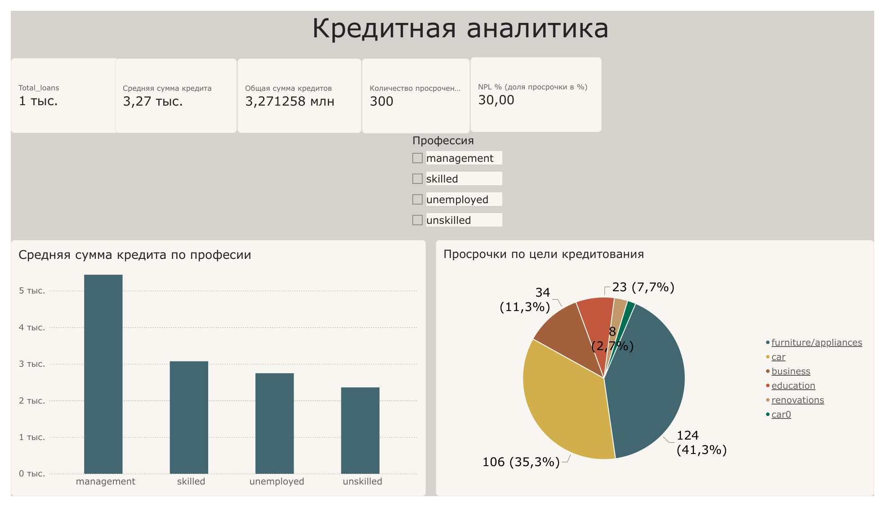
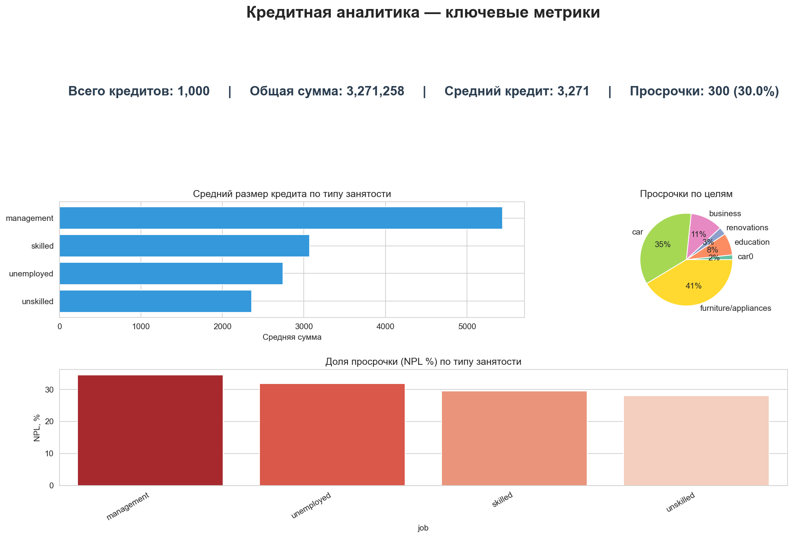

Кредитная аналитика 

Пет-проект по анализу кредитного портфеля: SQL-запросы, дашборд в Power BI и дашборд на Python.


- **SQL-анализ** ключевых метрик кредитного портфеля (NPL, средний размер, разрезы по профессиям и целям).
- **Power BI-дашборд** — 5 KPI-карточек, гистограмма по профессиям, круговая диаграмма по целям, слайсер.
- **Python-дашборд** — статичный PNG на matplotlib + интерактивный на Streamlit.

## 🗂 Структура проекта

```
credit-analysis/
├── sql/                # SQL-запросы для анализа
├── powerbi/            # .pbix-файл отчёта
├── python/             # код дашборда (matplotlib + streamlit)
├── data/               # данные (если публичны)
└── README.md
```

## 📈 Ключевые метрики

| Метрика | Значение |
|---|---|
| Всего кредитов | 1 000 |
| Общая сумма | 3 271 258 ₽ |
| Средний кредит | 3 271 ₽ |
| Просрочка (NPL) | 30 % |

🖼 Скриншоты

Power BI


Python (matplotlib)


🛠 Стек

- SQL (PostgreSQL)
- Power BI Desktop
- Python: pandas, matplotlib, seaborn


